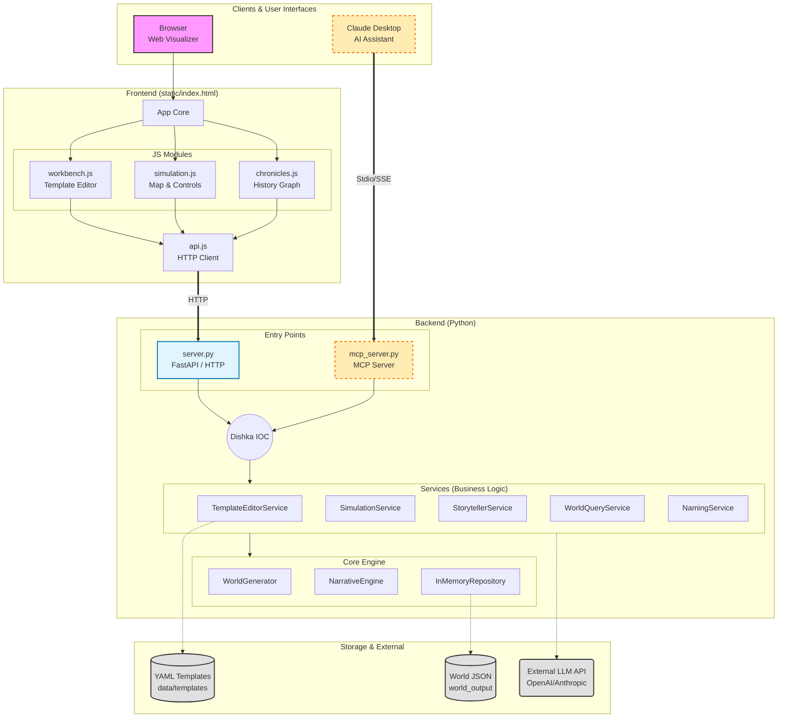

# WorHE 🌍

[](https://opensource.org/licenses/MIT)
[](https://www.python.org/downloads/)
[](https://modelcontextprotocol.io/)

**A narrative graph engine used to generate, track, and visualize fictional worlds using LLMs.**

[History graph viewer](assets/graph.png)

## 📖 Overview

World History Engine is an **MCP (Model Context Protocol) server** designed to be the "backend" for your AI storytelling. Unlike simple text generation, this engine maintains a consistent internal graph database of entities (Factions, Characters, Locations) and their relationships.

It allows Large Language Models (like Claude) to:
1.  **Contextualize:** Query the current state of the world before writing.
2.  **Mutate:** Create new entities or kill existing ones based on narrative events.
3.  **Visualize:** See the world evolve over time with a built-in interactive graph explorer.

## ✨ Key Features

* **🕵️‍♂️ RAG for Fiction:** Keeps track of thousands of entities without filling up the LLM context window.
* **🕸️ Graph-Based Consistency:** Entities have strict relationships (e.g., `Faction A --[war]--> Faction B`).
* **⏳ Time-Travel Debugging:** Includes a web-based visualizer (`world_viz.html`) with a timeline slider. Roll back history to see how the world looked 50 epochs ago.
* **🛠️ Customizable Templates:** Define your own races, biomes, and political systems via simple YAML files.

## 🚀 Quick Start

### Prerequisites
* Python 3.11+
* `uv` (recommended) or `pip`

### Installation

```bash
# Clone the repository
git clone [https://github.com/your-username/world-history-engine.git](https://github.com/your-username/world-history-engine.git)
cd world-history-engine

# Install dependencies
uv sync
````

### Running the graph visualization

```bash
uv run server 
# Then click: http://0.0.0.0:8000
```

### Running the MCP Server manually

```bash
# Run the server with SSE transport (default)
uv run mcp_server.py
```

## 🤖 Using with Claude Desktop or Qwen Desktop

To use this engine as a tool inside Claude, add the following configuration to your `claude_desktop_config.json`:

```json
{
  "mcpServers": {
    "world-engine": {
      "command": "uv",
      "args": [
        "run",
        "mcp_server.py"
      ],
      "env": {
        "PYTHONUNBUFFERED": "1"
      }
    }
  }
}
```

To use this engine as a tool inside Qwen Desktop, paste the following configuration in the MCP settings:
```json
{
    "mcpServers": {
        "world-builder": {
            "url": "http://0.0.0.0:8000"
        }
    }
```
And add [description](system_prompt.md)

*Note: You may need to specify the absolute path to `mcp_server.py` depending on your setup.*

## 📊 Visualizing Your World

The engine comes with a HTML visualizers.

1.  Generate some history using Claude.
2.  Open `static/world_viz.html` or `static/index.html` (after running `uv run server`) in your browser.
3.  Upload the JSON export of your world (generated via the `get_world_metadata` or export tools).
4.  **Explore:** Drag nodes, filter by factions, and use the **Timeline Slider** at the bottom to replay history.

[Templates AI generator](assets/workbench.png)

## ⚙️ Configuration & Templates

The engine's logic is data-driven. You can modify the simulation rules in `data/templates/`:

  * `factions.yaml`: Define cultures, taboos, and aggression levels.
  * `biomes.yaml`: Configure environmental generation.
  * `resources.yaml`: Manage economy items.

Example `factions.yaml`:

```yaml
- id: fac_human_kingdom
  tags: [honor, monarchy]
  culture:
    aggression: 5
    collectivism: 8
```

## 🏗 Architecture

Here is the internal structure of the world engine entities:



## 🗺️ Roadmap

  * [ ] Persistent storage (PostgreSQL/Neo4j support)
  * [ ] Multi-agent simulation steps
  * [ ] Direct export to PDF/Wiki format
  * [ ] Interactive map generation

## 🤝 Contributing

Contributions are welcome\! Please check out the issues tab or submit a PR.

1.  Fork the repository
2.  Create your feature branch (`git checkout -b feature/amazing-feature`)
3.  Commit your changes (`git commit -m 'Add some amazing feature'`)
4.  Push to the branch (`git push origin feature/amazing-feature`)
5.  Open a Pull Request

## 📄 License

This project is licensed under the MIT License.
